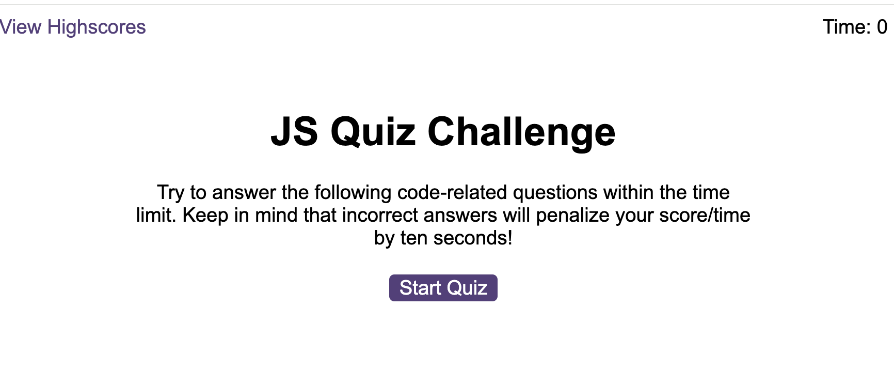
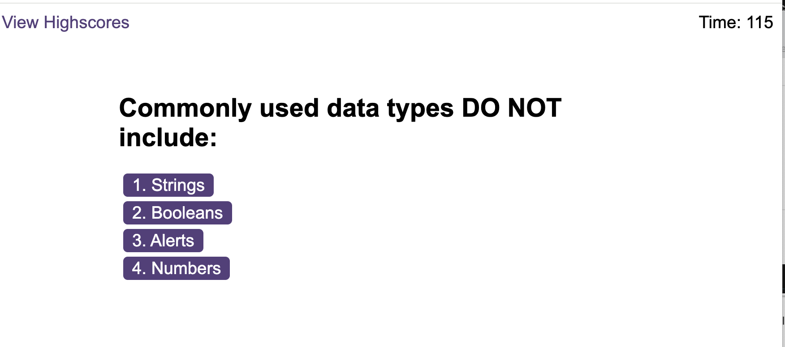
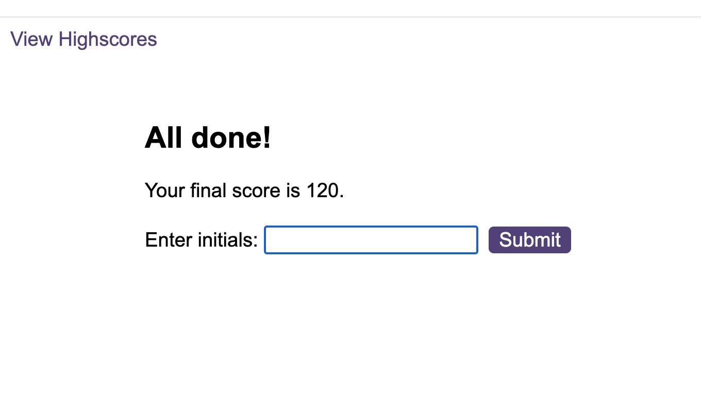
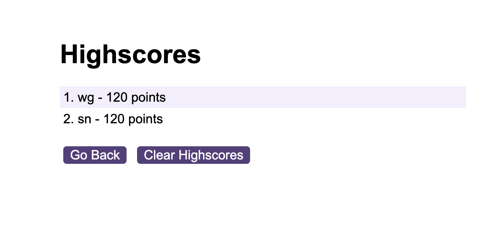

# Code Quiz Challenge


## 1. Description

A simple timed JavaScript quiz for aspiring web developers utilising JavaScript ability to dynamically render HTML and CSS.


## 3.Table of Contents

- [Installation](#4-installation)
- [Usage](#5-usage)
- [Features](#6-features)
- [Contributing](#7-contributing)
- [Screenshots and link](#8-screenshots-and-link)
- [Links](#9-links)


## 4. Installation

  ### 1. Git Bash

  Open Git Bash and use the following command to navigate to the directory where you want to clone the Word-Quiz-Game:

  ```bash
  cd path/to/Word-Quiz-Game
  ```

  ### 2. Clone the Repository

  Clone this repository to your local machine using the following command:

  ```bash
  git clone https://github.com/shkendi/Word-Quiz-Game.git
  ```

  ### 3. Start the Quiz
  - On Windows
    ```bash
    start index.html
    ```

  - On Mac or Linux
    ```bash
    open index.html
    ```

## 5. Usage

  This JavaScript quiz is designed to test and enhance your JavaScript knowledge. Follow the installation instructions, start the quiz, answer the questions within the given time, and see how well you perform.

## 6. Features

- Timed quiz with dynamic rendering of questions and choices.

- User-friendly interface with visual elements for a better gaming experience.

- Sound effects for correct and incorrect answers.

- High score tracking for competitive play.

## 7. Contributing

  Contributions are welcome! 

1. **Fork the Repository:**
   - Fork this repository to your GitHub account.

2. **Clone the Repository:**
   - Clone the forked repository to your local machine:
     ```bash
     git clone https://github.com/shkendi/Word-Quiz-Game.git
     ```

3. **Create a Branch:**
   - Create a new branch for your contribution:
     ```bash
     git checkout -b feature/your-feature
     ```

4. **Make Changes:**
   - Make your changes to the codebase.

5. **Test Your Changes:**
   - Test your changes locally to ensure they work as expected.

6. **Commit Your Changes:**
   - Commit your changes with a descriptive commit message:
     ```bash
     git commit -m "Add your descriptive message here"
     ```

7. **Push to Your Fork:**
   - Push your changes to your GitHub fork:
     ```bash
     git push origin feature/your-feature
     ```

8. **Open a Pull Request:**
   - Open a pull request on the main repository. Provide a clear and detailed description of your changes.


## 8. Screenshots and link to live demo

### Deployed Link: https://shkendi.github.io/Word-Quiz-Game/

  

  

  

  


## 9. Links

https://github.com/shkendi/Word-Quiz-Game